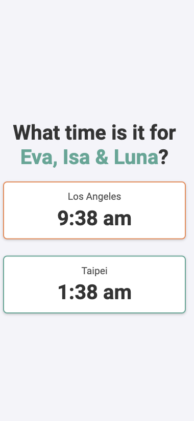

# Dual time zone clock
### Keep track of loved ones overseas

This simple web app helps you keep track of time for friends or family in another country. It displays two clocks side-by-side (or stacked on mobile) showing the current time in **Los Angeles** and **Taipei**.

## Features
- 📅 **Live updates**: The clocks automatically update every second.
- 🏠 **Local and remote times**: Displays time for Los Angeles and Taipei — or anywhere — regardless of the user's location.
- 🎨 **Responsive design**: Clocks adapt to look great on both mobile and desktop screens.
- 🔄 **Dynamic headline**: The headline alternates names like "Baba" and "Eva, Isa & Luna" to personalize the experience.

## How to Use
1. **Clone the repository**:
   ```bash
   git clone <repo-url>
   ```
2. **Open the HTML file**:
   Open the `index.html` file in any modern web browser.

3. **Deploy**:
   - You can host this page using [GitHub Pages](https://pages.github.com/) or any other static hosting service.

## Customization
- Update the **time zones** (e.g., `America/Los_Angeles` and `Asia/Taipei`) in the JavaScript to display different locations.
- Change the **names** in the headline rotation (in the `updateClocks` function).

## Technologies
- **HTML5** for structure
- **CSS3** for styling and responsiveness
- **Vanilla JavaScript** for real-time clock updates

## Screenshots



## Credits
Created to help families stay connected across time zones. ❤️
