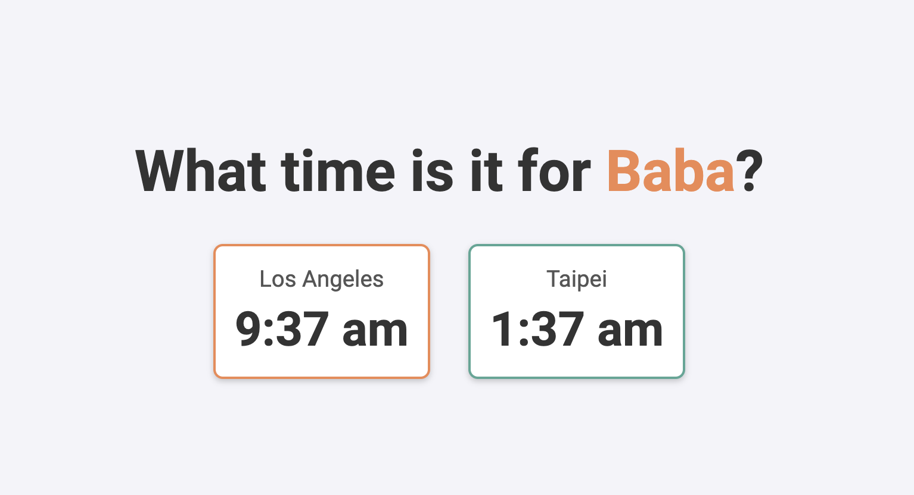

# Dual time zone clock

This simple web app helps you keep track of time in another country. It displays two clocks side-by-side (or stacked on mobile) showing the current time in **Los Angeles** and **Taipei**. It's deployed here: [https://mattstiles.me/our-time/](https://mattstiles.me/our-time/). 

## Features
- 📅 **Live updates**: The clocks automatically change, updating every second.
- 🏠 **Local and remote times**: Displays time for Los Angeles and Taipei regardless of the user's location.
- 🎨 **Responsive design**: Clocks adapt to look great on both mobile and desktop screens.
- 🔄 **Dynamic headline**: The headline alternates names like "Baba" and "Eva, Isa & Luna" to personalize the experience.
- 🗺️ **Mapbox integration**: Adds a monocrome base layer of the globe that highlights Los Angeles and Taiwan. The map also features the flight path of the journey that took loved ones out of their normal time zone. 
- 🗺️ **Event timing**: Features a countdown to an event — in this case a television show — so you can stay aligned with family on shared experiences. 

## How to Use
- **Clone the repository**:
   ```bash
   git clone <repo-url>
   ```
- **Open the HTML file**: Edit the `index.html` file and preview with a local server, e.g.:
   ```bash
   python -m http.server
   ```

- **Mapbox**: Deploy a Mapbox style and change key. 

- **Deploy**: You can host this page using [GitHub Pages](https://pages.github.com/) or any other static hosting service.

## Customization
- Update the **time zones** (e.g., `America/Los_Angeles` and `Asia/Taipei`) in the JavaScript to display different locations.
- Change the **names** in the headline rotation (in the `updateClocks` function).
- **Mapbox**: Create a Mapbox base layer with your desired style and locations.
- **Change time zones**: Currently uses Taipei and Los Angeles.

## Tools
- **HTML5** for structure
- **CSS3** for styling and responsiveness
- **JavaScript** for real-time clock updates
- **Mapbox GL JS** for the background map and flight path

## Screenshots


## About
Created with ❤️ to help families stay connected across time zones. 